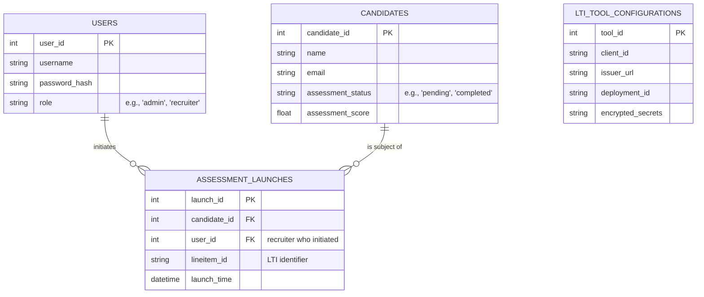

```mermaid
erDiagram
    USERS {
        int user_id PK
        string username
        string password_hash
        string role "e.g., 'admin', 'recruiter'"
    }

    CANDIDATES {
        int candidate_id PK
        string name
        string email
        string assessment_status "e.g., 'pending', 'completed'"
        float assessment_score
    }

    ASSESSMENT_LAUNCHES {
        int launch_id PK
        int candidate_id FK
        int user_id FK "recruiter who initiated"
        string lineitem_id "LTI identifier"
        datetime launch_time
    }

    LTI_TOOL_CONFIGURATIONS {
        int tool_id PK
        string client_id
        string issuer_url
        string deployment_id
        string encrypted_secrets
    }

    USERS ||--o{ ASSESSMENT_LAUNCHES : "initiates"
    CANDIDATES ||--o{ ASSESSMENT_LAUNCHES : "is subject of"
```